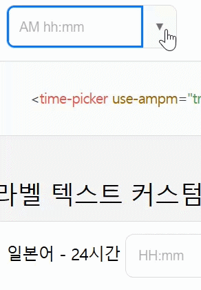

> **Note**: This document has been translated using AI.

# `ampmTimepicker.js` Usage Guide

`<time-picker>` is a timepicker implemented as a Custom Web Component. It supports both AM/PM 12-hour and 24-hour formats and includes an intuitive UI with built-in keyboard accessibility (arrow keys and tab navigation).

## Demo
https://akreid.github.io/ampm-timepicker/



## 🚀 Installation & Usage
```bash
npm install @akreid/ampm-timepicker
```

Include the script in your HTML file and use the `<time-picker>` custom tag.

```html
<!-- Include script -->
<script src="/ampmTimepicker.js"></script>

<!-- Basic usage -->
<time-picker></time-picker>
```

## ⚙️ Attributes

You can control the picker's behavior and display format by adding attributes to the component tag.

| Attribute | Type | Default | Description |
|---|---|---|---|
| `use-ampm` | `boolean` | `false` | When set to `true`, it operates in an AM/PM 12-hour format. (Defaults to 24-hour format if not set) |
| `interval` | `number` | `1` | Sets the minute selection interval. (e.g., `5`, `10`, `15`) |
| `start-time` | `string` | `00:00` | The minimum selectable time (Format: `HH:mm`, based on 24-hour format) |
| `end-time` | `string` | `23:59` | The maximum selectable time (Format: `HH:mm`, based on 24-hour format) |
| `margin-right`| `string` | `0px` | Sets the right margin. (e.g., `10px`) |
| `hour-label` | `string` | `null` | The label displayed at the top of the Hour column in the dropdown |
| `min-label` | `string` | `null` | The label displayed at the top of the Minute column in the dropdown |
| `ampm-label` | `string` | `null` | The label displayed at the top of the AM/PM column in the dropdown |
| `disabled` | `boolean`| `false` | When set to `true`, the component is disabled and interaction is blocked |
| `readonly` | `boolean`| `false` | When set to `true`, the value cannot be changed by the user |
| `required` | `boolean`| `false` | When set to `true`, the field must be filled before submitting a form |
| `name` | `string` | `null` | The name of the element used for form submission |
| `value` | `string` | `null` | The initial time value (Format: `HH:mm`) |

### HTML Example
```html
<time-picker 
  use-ampm="true" 
  interval="10" 
  start-time="09:00" 
  end-time="18:30" 
  hour-label="Hour" 
  min-label="Min" 
  ampm-label="AM/PM"
  margin-right="8px">
</time-picker>
```

## 🎨 CSS Custom Properties (Variables)

The appearance of the component's internals (Shadow DOM) can be customized externally using CSS variables.

| Variable Name | Default Value | Description |
|---|---|---|
| `--width` | `165px` | The total width of the input form |
| `--height` | `42px` | The total height of the input form |
| `--border-radius`| `8px` | The border-radius for all corners |
| `--bg-color` | `#fff` | Component background color |
| `--font-color` | `#333` | Text color |
| `--primary-color`| `#007bff` | Outline color on focus and active list item color |
| `--border-color` | `#ddd` | Border line color |
| `--bg-hover` | `#f1f7ff` | Background color of list items on hover and active state |
| `--toggle-icon-url` | `none` | Icon image of the right toggle button (in `url('...')` format) |
| `--toggle-icon-size`| `16px` | Size of the toggle icon |

### CSS Usage Example
```css
/* Define globally or on a specific class in your stylesheet */
time-picker {
  --primary-color: #ff5722;
  --bg-color: #f9f9f9;
  --border-radius: 4px;
  --toggle-icon-url: url('../images/icon_clock.svg');
}
```

## 💻 JavaScript API

### 1. Properties
You can get the selected time or change it dynamically through the `value` property.
> 💡 **Note**: The input/output format of the value is always a 24-hour `HH:mm` string.

```javascript
const picker = document.querySelector('time-picker');

// Set a value
picker.value = '14:30'; 

// Get the current value
console.log(picker.value); // "14:30"
```

### 2. Events
`change` event is triggered whenever the time changes. You can check the selected value in `e.detail.value`.

```javascript
const picker = document.querySelector('time-picker');

picker.addEventListener('change', (e) => {
  const selectedTime = e.detail.value;
  console.log('Selected time:', selectedTime); // e.g., "09:00"
});
```

### 3. Form Integration
Since it supports `ElementInternals`, you can use it directly inside a `<form>` tag like a native input.

```html
<form id="myForm">
  <label for="event-time">Event Time:</label>
  <time-picker name="event-time" required></time-picker>
  <button type="submit">Submit</button>
</form>

<script>
  document.getElementById('myForm').addEventListener('submit', (e) => {
    e.preventDefault();
    const formData = new FormData(e.target);
    console.log(formData.get('event-time')); // Returns "HH:mm"
  });
</script>
```

## ⌨️ Accessibility and UX
This component is designed to be fully operable using a keyboard, in addition to a mouse.

- **Smart Typing Input**: Typing numbers into the input field automatically auto-corrects to the specified format.
- **Arrow Key Navigation (Input)**: While the input is focused, pressing the `↑` (Up) or `↓` (Down) keys will increment/decrement the time by the `interval` unit.
- **Dropdown Navigation**: 
  - When the dropdown is open, pressing the `←` or `→` keys will switch focus between the AM/PM, Hour, and Minute columns.
  - Within each column, use the `↑` or `↓` keys to navigate through the values.
- **Tab Focus Control**: Pressing the `Tab` key within the dropdown smoothly moves the focus to the next element. Logic is applied to prevent the browser address bar from capturing the focus (a common Shadow DOM focus trap issue).
- **Screen Scroll Synchronization**: Scrolling the browser window while the dropdown is open will automatically close the dropdown and commit the currently selected value.
